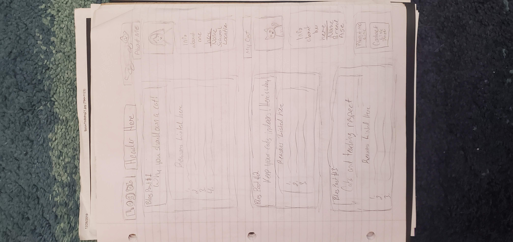
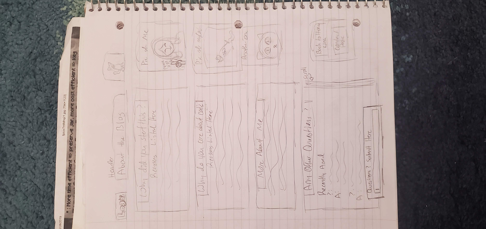
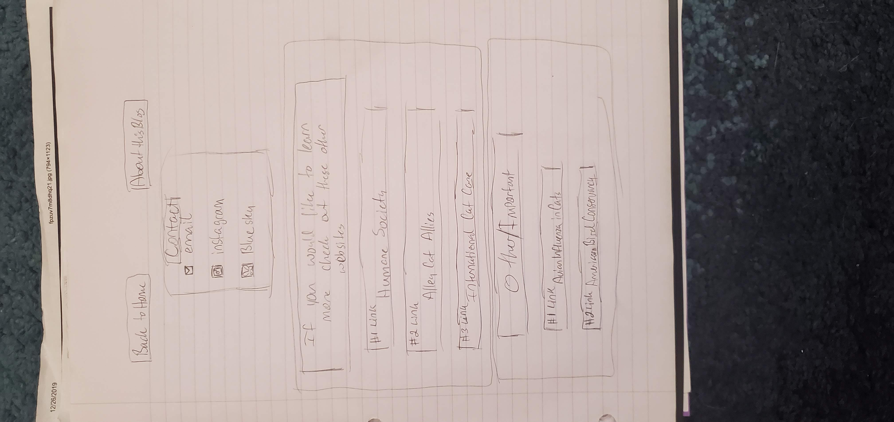

# My Cat and I's INF6420 Project

A portfolio in the style of a blog about owning a cat.

## Wireframes

Header - There will be a logo on the left side, the title of my blog in the center, and on the right a drawing of a cat

Main Content - There will be blog-styled posts. Examples are 'Why you should own cat!', 'Keep your cats indoors! Here's why.' and 'Cats and Teaching Respect'. All will have a paragraph or list going over the topic. 

Other Content - On the right side of the page there is a picture of me and my own cat with very basic information: names, ages, school, etc.

Navigation Menu - Will be under the Other Content and include links to the other pages: About Me and Contact

Header - There will be a logo on the left side, the title of the about page in the center, and on the right a drawing of a cat.

Main Content - There will be blog-styled psots. Examples are 'Why did you start this blog?', 'Why do you care about cats?', 'More About Me', and 'Any Other Questions?'. The first three will have a paragraph going over the question. The last post will mock-up questions with answers and a submission entry if the reader wants to ask a question.

Other Content - On the right side of the page there will be different pictures of my cat and I.

Navigation Menu - Will be under the Other Content and include links to the other pages: Home and Contact

Header - There will be a link to take the reader back to the Home page and another link to take the reader back to the About page.

Main Content - A square will have mock-up links for an email contact, an Instagram page, and a Bluesky page. The rest of the page will be of two posts. One will be about if the reader wants to learn more about cats and will have links directing them to sites like the Humane Society, Alley Cat Allies, and Internation Cat Care. The other post will be about Other Important Information an dwill have links directing them to sites like Avian Influenza in Cats and American Bird Conservancy. 